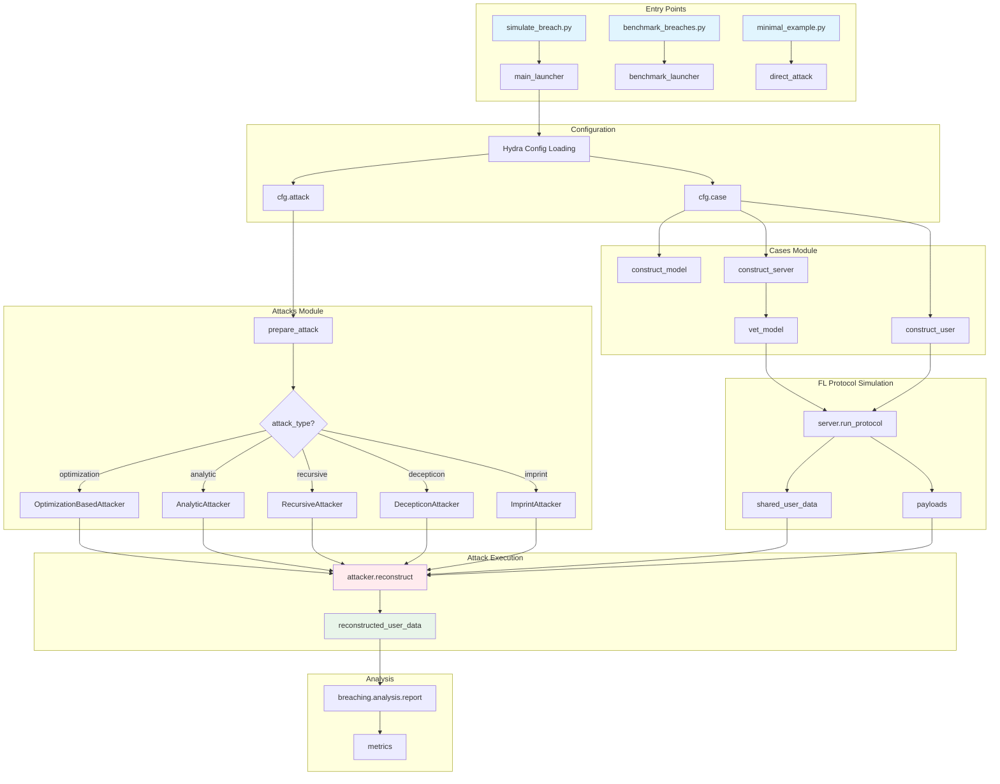
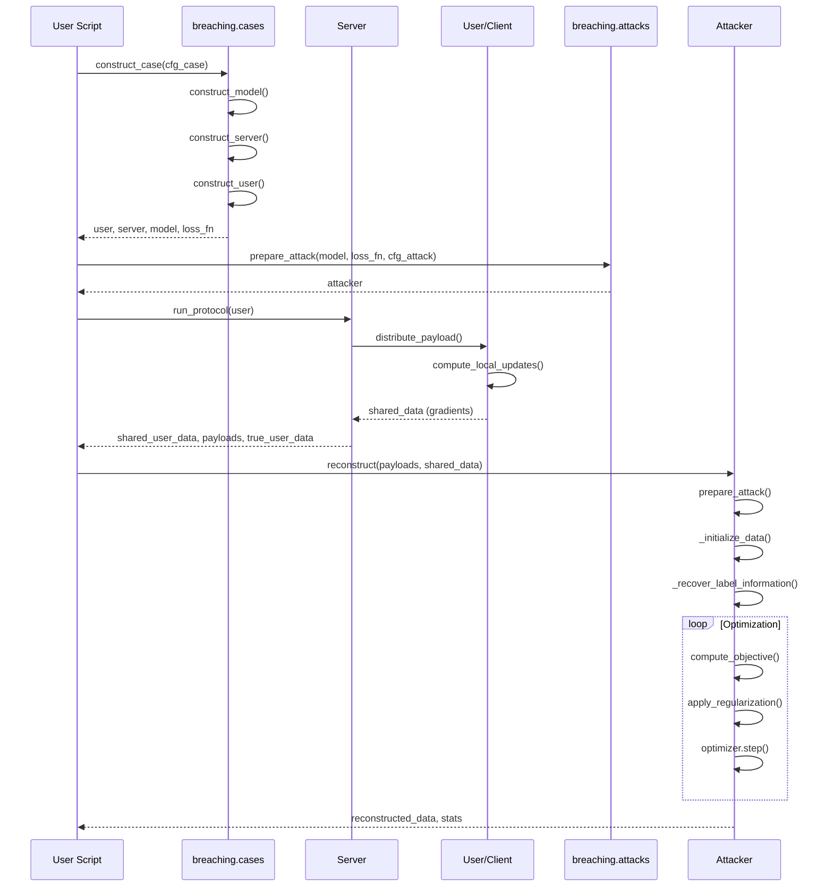

# Breaching Codebase Analysis

This document provides a comprehensive analysis of the **Breaching** framework - a PyTorch-based framework for gradient inversion attacks against privacy in federated learning.

---

## 1. Attack Cases and Strategies Implemented

The framework implements **9 attack types** across **17 different attack configurations**:

### Attack Types (Core Implementations)

| Attack Type | Implementation File | Description |
|-------------|---------------------|-------------|
| **Optimization** | [optimization_based_attack.py](file:///Users/smanna/Documents/IISc/RA/breaching/breaching/attacks/optimization_based_attack.py) | Standard gradient matching attacks (e.g., Inverting Gradients, Deep Leakage) |
| **Multiscale** | [multiscale_optimization_attack.py](file:///Users/smanna/Documents/IISc/RA/breaching/breaching/attacks/multiscale_optimization_attack.py) | Multi-resolution optimization attacks |
| **Analytic** | [analytic_attack.py](file:///Users/smanna/Documents/IISc/RA/breaching/breaching/attacks/analytic_attack.py) | Closed-form attacks for specific architectures |
| **April-Analytic** | [analytic_attack.py](file:///Users/smanna/Documents/IISc/RA/breaching/breaching/attacks/analytic_attack.py) | APRIL attack for Vision Transformers |
| **Imprint-Readout** | [analytic_attack.py](file:///Users/smanna/Documents/IISc/RA/breaching/breaching/attacks/analytic_attack.py) | Imprint attacks (Robbing the Fed) |
| **Decepticon-Readout** | [analytic_attack.py](file:///Users/smanna/Documents/IISc/RA/breaching/breaching/attacks/analytic_attack.py) | Decepticon attacks for transformers/LLMs |
| **Recursive** | [recursive_attack.py](file:///Users/smanna/Documents/IISc/RA/breaching/breaching/attacks/recursive_attack.py) | R-GAP recursive reconstruction |
| **Joint-Optimization** | [optimization_with_label_attack.py](file:///Users/smanna/Documents/IISc/RA/breaching/breaching/attacks/optimization_with_label_attack.py) | Joint optimization of data and labels |
| **Permutation-Optimization** | [optimization_permutation_attack.py](file:///Users/smanna/Documents/IISc/RA/breaching/breaching/attacks/optimization_permutation_attack.py) | Optimization with batch permutation |

### Available Attack Configurations

| Config Name | Attack Type | Use Case |
|-------------|-------------|----------|
| `invertinggradients` | optimization | Classic gradient inversion attack |
| `deepleakage` | joint-optimization | DLG - also optimizes labels |
| `analytic` | analytic | Analytic attack for linear models |
| `april_analytic` | april-analytic | APRIL attack for ViT |
| `decepticon` | decepticon-readout | Text recovery from transformers |
| `imprint` | imprint-readout | Robbing the Fed attack |
| `rgap` | recursive | R-GAP recursive attack |
| `seethroughgradients` | optimization | MOCO-based attack |
| `tag` | optimization | TAG attack for language models |
| `modern` | optimization | Modern hyperparameters |
| `clsattack` | optimization | Class attack |
| `beyondinfering` | optimization | Beyond Inferring Class Representatives |
| `legacy`, `wei`, `sanitycheck`, `multiscale_ghiasi` | various | Other variants |

### Use Case Configurations (Scenarios)

| Case Config | Description |
|-------------|-------------|
| `0_sanity_check` | Quick verification test |
| `1_single_image_small` | Single small image attack |
| `2_single_imagenet` | Single ImageNet image attack |
| `4_fedavg_small_scale` | Federated Averaging scenario |
| `5_small_batch_imagenet` | Small batch ImageNet |
| `6_large_batch_cifar` | Large batch CIFAR attack |
| `8_industry_scale_fl` | Industry-scale FL simulation |
| `9_bert_training` | BERT language model attack |
| `10_causal_lang_training` | Causal language model attack |

---

## 2. How to Run Attack Simulations

### Entry Points

There are **3 main entry points**:

1. **[simulate_breach.py](file:///Users/smanna/Documents/IISc/RA/breaching/simulate_breach.py)** - Single attack simulation
2. **[benchmark_breaches.py](file:///Users/smanna/Documents/IISc/RA/breaching/benchmark_breaches.py)** - Benchmark over multiple trials
3. **[minimal_example.py](file:///Users/smanna/Documents/IISc/RA/breaching/minimal_example.py)** - Minimal standalone example

### Command Line Usage

```bash
# Basic attack simulation (uses defaults: ImageNet + InvertingGradients)
python simulate_breach.py

# Dry run test (single iteration)
python simulate_breach.py dryrun=True

# Specify attack and case
python simulate_breach.py attack=decepticon case=9_bert_training

# Change hyperparameters
python simulate_breach.py attack=invertinggradients attack.optim.max_iterations=10000

# Run benchmark
python benchmark_breaches.py attack=invertinggradients num_trials=50

# Save reconstruction results
python simulate_breach.py save_reconstruction=True
```

### Programmatic Usage (Python API)

```python
import breaching
import torch

# 1. Load configurations
cfg_case = breaching.get_case_config(case="1_single_image_small")
cfg_attack = breaching.get_attack_config(attack="invertinggradients")

setup = dict(device=torch.device("cuda"), dtype=torch.float)

# 2. Construct case (model, server, user)
user, server, model, loss_fn = breaching.cases.construct_case(cfg_case, setup)

# 3. Prepare attacker
attacker = breaching.attacks.prepare_attack(model, loss_fn, cfg_attack, setup)

# 4. Run FL protocol simulation
shared_user_data, payloads, true_user_data = server.run_protocol(user)

# 5. Run attack
reconstructed_user_data, stats = attacker.reconstruct(
    payloads, shared_user_data, server.secrets, dryrun=False
)

# 6. Analyze results
metrics = breaching.analysis.report(
    reconstructed_user_data, true_user_data, payloads, model,
    cfg_case=cfg_case, setup=setup
)
```

### Common Hydra Override Examples

```bash
# Change optimizer settings
python simulate_breach.py attack.optim.optimizer=sgd attack.optim.step_size=0.01

# Change regularization
python simulate_breach.py attack.regularization.total_variation.scale=0.5

# Change number of restarts
python simulate_breach.py attack.restarts.num_trials=8

# Change user settings
python simulate_breach.py case.user.num_data_points=4

# Change data partition
python simulate_breach.py case.data.partition=unique-class
```

---

## 3. Code Flow Diagram



### Detailed Attack Flow



---

## 4. Creating a New Attack Strategy

### Files to Create/Edit

To create a new attack strategy, follow these steps:

#### Step 1: Create Attack Implementation

Create a new file in `breaching/attacks/`:

```
breaching/attacks/my_new_attack.py
```

Inherit from `_BaseAttacker`:

```python
"""My new attack implementation."""
from .base_attack import _BaseAttacker

class MyNewAttacker(_BaseAttacker):
    def __init__(self, model, loss_fn, cfg_attack, setup):
        super().__init__(model, loss_fn, cfg_attack, setup)
        # Initialize attack-specific parameters
    
    def reconstruct(self, server_payload, shared_data, server_secrets=None, dryrun=False):
        """
        Main attack method.
        
        Args:
            server_payload: List of payloads from server
            shared_data: List of user gradient data
            server_secrets: Optional server secrets
            dryrun: If True, run minimal iterations
            
        Returns:
            dict: Contains 'data' and 'labels' tensors
            dict: Attack statistics
        """
        # Prepare attack
        rec_models, labels, stats = self.prepare_attack(server_payload, shared_data)
        
        # Your attack logic here
        reconstructed_data = self._run_my_attack(rec_models, shared_data, labels)
        
        return {"data": reconstructed_data, "labels": labels}, stats
```

#### Step 2: Register the Attack

Edit [breaching/attacks/__init__.py](file:///Users/smanna/Documents/IISc/RA/breaching/breaching/attacks/__init__.py):

```python
from .my_new_attack import MyNewAttacker

def prepare_attack(model, loss, cfg_attack, setup=...):
    # ... existing code ...
    elif cfg_attack.attack_type == "my-new-attack":
        attacker = MyNewAttacker(model, loss, cfg_attack, setup)
    # ... rest of code ...
```

#### Step 3: Create Attack Configuration

Create a new YAML file in `breaching/config/attack/`:

```yaml
# breaching/config/attack/mynewattack.yaml
type: my_new_attack

attack_type: my-new-attack
label_strategy: bias-corrected

# Your attack hyperparameters
my_param1: 0.5
my_param2: 100

optim:
  optimizer: adam
  step_size: 0.1
  max_iterations: 5000

regularization:
  total_variation:
    scale: 0.1

impl:
  dtype: float
  mixed_precision: False
```

#### Step 4: Add New Regularizers or Objectives (Optional)

- **New regularizer**: Add to [breaching/attacks/auxiliaries/regularizers.py](file:///Users/smanna/Documents/IISc/RA/breaching/breaching/attacks/auxiliaries/regularizers.py)
- **New objective**: Add to [breaching/attacks/auxiliaries/objectives.py](file:///Users/smanna/Documents/IISc/RA/breaching/breaching/attacks/auxiliaries/objectives.py)

### Key Files Reference

| Purpose | File |
|---------|------|
| Base attack class | [base_attack.py](file:///Users/smanna/Documents/IISc/RA/breaching/breaching/attacks/base_attack.py) |
| Attack factory | [attacks/__init__.py](file:///Users/smanna/Documents/IISc/RA/breaching/breaching/attacks/__init__.py) |
| Regularizers | [auxiliaries/regularizers.py](file:///Users/smanna/Documents/IISc/RA/breaching/breaching/attacks/auxiliaries/regularizers.py) |
| Objectives | [auxiliaries/objectives.py](file:///Users/smanna/Documents/IISc/RA/breaching/breaching/attacks/auxiliaries/objectives.py) |
| Optimizers | [auxiliaries/common.py](file:///Users/smanna/Documents/IISc/RA/breaching/breaching/attacks/auxiliaries/common.py) |

---

## 5. Modifying Hyperparameters for Existing Attacks

### Option 1: Command Line Overrides (Recommended)

Use Hydra's override syntax:

```bash
# Modify optimization settings
python simulate_breach.py \
    attack=invertinggradients \
    attack.optim.max_iterations=50000 \
    attack.optim.step_size=0.05 \
    attack.optim.optimizer=sgd

# Modify regularization
python simulate_breach.py \
    attack.regularization.total_variation.scale=0.5

# Modify objective
python simulate_breach.py \
    attack.objective.type=euclidean \
    attack.objective.scale=0.001

# Modify restarts/trials
python simulate_breach.py \
    attack.restarts.num_trials=8 \
    attack.restarts.scoring=cosine-similarity
```

### Option 2: Edit YAML Config Files Directly

Edit files in `breaching/config/attack/`:

| Setting | File | Parameters |
|---------|------|------------|
| **Inverting Gradients** | [invertinggradients.yaml](file:///Users/smanna/Documents/IISc/RA/breaching/breaching/config/attack/invertinggradients.yaml) | `optim.max_iterations`, `optim.step_size`, `regularization.total_variation.scale` |
| **Default optimization** | [_default_optimization_attack.yaml](file:///Users/smanna/Documents/IISc/RA/breaching/breaching/config/attack/_default_optimization_attack.yaml) | Base settings for all optimization attacks |
| **Decepticon** | [decepticon.yaml](file:///Users/smanna/Documents/IISc/RA/breaching/breaching/config/attack/decepticon.yaml) | `token_strategy`, `embedding_token_weight`, `sentence_algorithm` |

### Option 3: Programmatic Override

```python
import breaching

# Load config with overrides
cfg_attack = breaching.get_attack_config(
    attack="invertinggradients",
    overrides=[
        "optim.max_iterations=50000",
        "optim.step_size=0.05",
        "regularization.total_variation.scale=0.5"
    ]
)
```

### Key Hyperparameters by Attack Type

#### Optimization-Based Attacks

| Parameter | Location | Description |
|-----------|----------|-------------|
| `optim.max_iterations` | attack.optim | Number of optimization steps |
| `optim.step_size` | attack.optim | Learning rate |
| `optim.optimizer` | attack.optim | `adam`, `sgd`, `lbfgs` |
| `optim.signed` | attack.optim | `None`, `soft`, `hard` |
| `regularization.total_variation.scale` | attack.regularization | TV regularization weight |
| `restarts.num_trials` | attack.restarts | Number of random restarts |
| `objective.type` | attack.objective | `cosine-similarity`, `euclidean` |
| `init` | attack | Initialization: `randn`, `zeros`, `patterned-4` |

#### Analytic Attacks

| Parameter | Location | Description |
|-----------|----------|-------------|
| `token_strategy` | attack | Token recovery method |
| `token_cutoff` | attack | Threshold for token recovery |
| `sentence_algorithm` | attack | `k-means`, `greedy` |

### Case/Scenario Hyperparameters

Edit files in `breaching/config/case/`:

```bash
# User settings
python simulate_breach.py \
    case.user.num_data_points=8 \
    case.user.user_idx=42

# Data settings
python simulate_breach.py \
    case.data.partition=balanced \
    case.data.default_clients=100

# Server settings
python simulate_breach.py \
    case.server.pretrained=True
```

---

## Summary of Key Files

| Purpose | Path |
|---------|------|
| **Entry Points** | |
| Single simulation | [simulate_breach.py](file:///Users/smanna/Documents/IISc/RA/breaching/simulate_breach.py) |
| Benchmarking | [benchmark_breaches.py](file:///Users/smanna/Documents/IISc/RA/breaching/benchmark_breaches.py) |
| Minimal example | [minimal_example.py](file:///Users/smanna/Documents/IISc/RA/breaching/minimal_example.py) |
| **Core Module** | |
| Module init | [breaching/__init__.py](file:///Users/smanna/Documents/IISc/RA/breaching/breaching/__init__.py) |
| **Attacks** | |
| Attack factory | [attacks/__init__.py](file:///Users/smanna/Documents/IISc/RA/breaching/breaching/attacks/__init__.py) |
| Base class | [attacks/base_attack.py](file:///Users/smanna/Documents/IISc/RA/breaching/breaching/attacks/base_attack.py) |
| Optimization attack | [attacks/optimization_based_attack.py](file:///Users/smanna/Documents/IISc/RA/breaching/breaching/attacks/optimization_based_attack.py) |
| Analytic attack | [attacks/analytic_attack.py](file:///Users/smanna/Documents/IISc/RA/breaching/breaching/attacks/analytic_attack.py) |
| **Cases** | |
| Case factory | [cases/__init__.py](file:///Users/smanna/Documents/IISc/RA/breaching/breaching/cases/__init__.py) |
| Server impl | [cases/servers.py](file:///Users/smanna/Documents/IISc/RA/breaching/breaching/cases/servers.py) |
| User impl | [cases/users.py](file:///Users/smanna/Documents/IISc/RA/breaching/breaching/cases/users.py) |
| **Config** | |
| Main config | [config/cfg.yaml](file:///Users/smanna/Documents/IISc/RA/breaching/breaching/config/cfg.yaml) |
| Attack configs | [config/attack/](file:///Users/smanna/Documents/IISc/RA/breaching/breaching/config/attack) |
| Case configs | [config/case/](file:///Users/smanna/Documents/IISc/RA/breaching/breaching/config/case) |
| **Examples** | |
| Jupyter notebooks | [examples/](file:///Users/smanna/Documents/IISc/RA/breaching/examples) |
